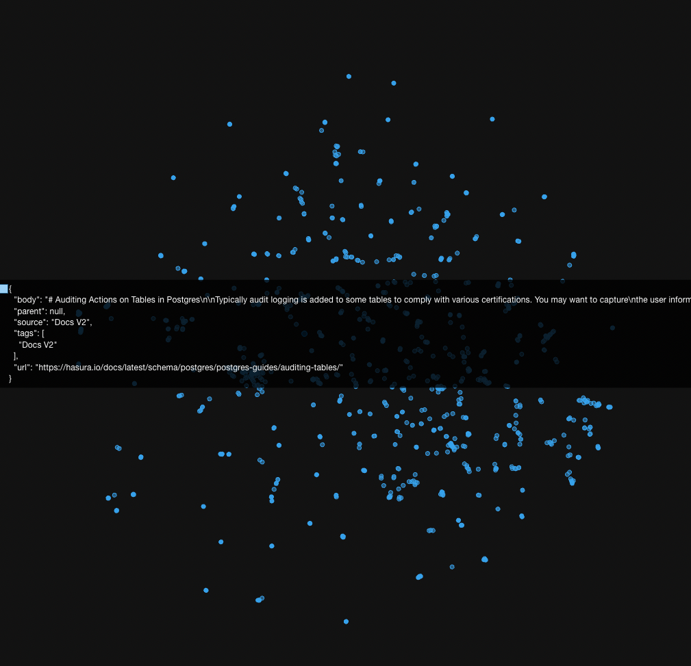
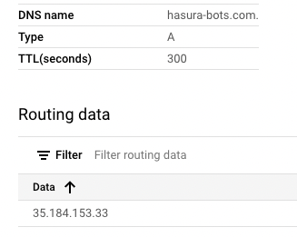
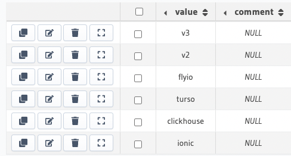
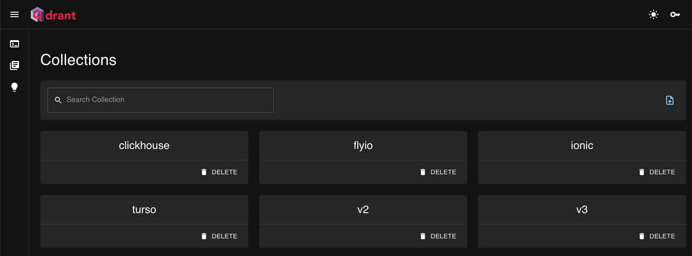
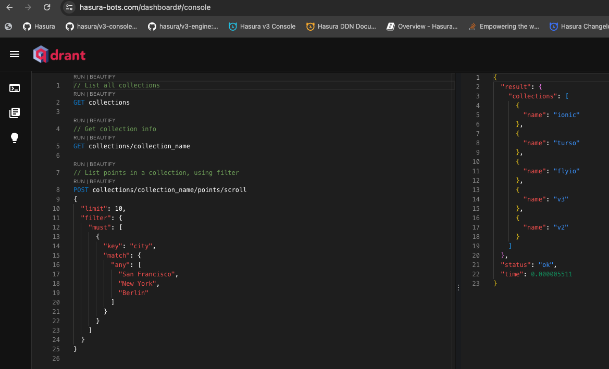

# An OSS Discord Bot to converse with Qdrant document collections using OpenAI's latest models built for HN.

This repository contains the code for a Discord bot. There is a sprinkle of Nginx, a dash of Qdrant, some Postgres, of
course Hasura, discord.py, a smidge of selenium and beautifulsoup, and a lot of production ready Python with only a few
dragons 🐲.

What might this bot do you wonder? I shall tell you! It's magic. 🧙‍♂️🪄

This Discord bot provides the ability to search and talk to technical documentation, or in theory any documentation.

I needed to write both a README and a blog post so let's double up, such is the life.

If you work for or use Hasura, Clickhouse, Turso, Fly.io, or Ionic. (And more to come soon, see CONTRIBUTING) this
bot will be useful to you, so come try it. If you use [Docusaurus](https://docusaurus.io/blog/releases/3.1) then the
provided web-scraper should work for you. (Although Algolia has me curious, I found it half-way through this project.
Does anyone know if it's any good? Can I get it to spit out Markdown?)

I've also always been a production or GTFO kind of person, therefore the database I've deployed for this has a READONLY
api-key. The bot runs in the [Hasura Discord server](https://discord.gg/hasura). Just use `/commands` in a Discord
channel to see the capabilities. To converse with the bot, ask a Hasura related question in either the v2-help-forum or
the v3-help-forum.

Feel free to go over to [the production Qdrant dashboard](https://hasura-bots.com/dashboard) and use the following
READONLY API key ```95a7cc2e3087b032edd2fd71de5b3a8d48313d601e6ce70b538ce5c8f730d93d``` to peruse the vector database
points. (Hint. It is a database full of embeddings of scraped technical documentation written in markdown.)

A long time ago, these guys named Larry and Sergey decided to scrape the internet to organize the world's information,
and it was hard. They also organized it about as well as a 5-year-old might organize their chest of toys, by generally
doing their best to throw similar things into the same bucket from across the room via a giant firehouse. See, Larry and
Sergey didn't have [Word2Vec,](https://en.wikipedia.org/wiki/Word2vec) and they definitely
didn't have the new `text-embedding-3-large` embedding-model from OpenAI, or the `gpt-4-turbo-preview`, also known
as `gpt-4-0125-preview` which [as OpenAI puts it](https://platform.openai.com/docs/models/gpt-4-and-gpt-4-turbo) is: "
The latest GPT-4 model intended to reduce cases of “laziness” where
the model doesn’t complete a task. Returns a maximum of 4,096 output tokens." which by the way has a 120,000 token
context window. What a perfect and beautiful storm. It's not that the spider algorithm wasn't great for crawling the 🕸.
Larry and Sergey just didn't have a 🧠. Wait..., no, that didn't come out right, What I mean to say is, using AI, we can
sieve the data that comes through the firehose as it comes through, create semantic embeddings via word2vec, and then
create our own purpose-specific mini-google that comes with a support-bot kind of like clippy, or Siri, or Alexa... but
if any of those were actually good, and currently minus the voice activated, but I'll look into it, all that would take
is a pinch of ffmpeg after all.

Here's the motivation for this project:

We should be able to completely automate every single support request that comes in that could be solved if the user had
thoroughly read the entirety of the documentation. For every request that can't be solved if that had occurred, when a
community member or a member of the support staff comes in and solves it, we can use that to train the AI in the future,
and perhaps in further iterations of this project, use the conversations to generate new or additional documentation.💡
This makes support a vital and helpful role, as it creates incentives to find correct reproducible solutions over quick
solutions, even though currently support roles often are called in when things are on fire, and people are in panic
mode. This motivates all team members to properly solve each problem because all problems only need to be solved one
time. By providing a searchable history of all previous inquiries as well, you can build the help you want to receive.
I've not yet fine-tuned this bot, I need people to create and vote on inquiries to collect the data to do so.
Conversational style threads will be best. I think it might be nice to curate the threads after the fact with a GPT
comb-over. One model fine-tuned to editorialize the conversation. One model fine-tuned to create lists of disparities in
docs. One model fine-tuned to take all that information and pop out updated documentation. People become curators of
information rather than rote secretaries. Information doesn't get lost, and you can copy customer interaction flows.
Almost like a compile step. Imagine taking 10 models and layering them to chunk down information. If you build good
data-sets of the work-flow in action, you could revolutionize the way information moves.

Now we have magical tools like beautifulsoup and selenium, and you can do cosine-similarity searches at
scale in a magical land where anything runs called Docker. A sprinkle of Qdrant, a dash of Nginx, a pinch of Postgres, a
dollop of FastAPI and a Discord bot with an event loop later you've got a powerful tool, of course all powered by
Hasura. It's a very different world today. A new age, a new era is upon us! To truly get a grasp on what I'm getting at,
look at how you can now visually identify semantic gaps in your documentation. You can understand where a user might get
confused, before they get confused by looking at points that are far apart, or don't have a decent path to walk, or
perhaps the path is just too long. Visualize the breadcrumbs and trails users will walk when they desire to do certain
actions or have specific use-cases and understand how you can support them before they even ask the questions.



So without further ado, let's dive in. I've broken this into sections. It's nitty-gritty technical, but if you've made
it this far, you're clearly my type of reader, so hang on. We're doing a deep-dive.

## Part One: Scraping the documentation.

Why build a scraper? Because then I could use it on things other than documentation, in theory. It's a proof-of-concept.
I built this whole thing in a week, so let's not judge too harshly.

I started by building a quick and dirty ChatGPT collaborative hack-n-slash script that consisted of me running the
script, seeing it get snagged or format something a way I didn't like as it would write each page to a markdown file,
point the scraper at that page, then copy-paste the exception and the html and occasionally hand-guide it a bit
inspecting the page and doing some beautifulsoup magic. It was mostly ChatGPT doing the dirty work and me trying to
make it work as fast as I possibly could, since I couldn't really justify spending more than a day on the scraper.

In the end, the scraper ended up being very specific to Docusaurus. I thought about trying to scrape other documentation
sites, but then realized... well, everybody's docs for the most part can be represented or easily turned into Markdown,
that's on other people. If you want your docs added, send me a script to scrape your docs and structure them as markdown
however you want them to appear. Some people have asked me, but Tristen, why scrape the docs? I wanted fully qualified
links, not relative links and I really wanted to test out how things worked with different companies documentation as
well, plus don't hate on the selenium + bs4 combo. We use all kinds of tools internally, and I figured the semantic
search results with hyperlinks to the document they are closest to is essentially a super-powered Google search and when
I fed the results to the latest GPT model, the outputs were pretty great. The citation of sources is nice. What's nicer
is being able to re-run the scraper to update things.

Although I may have accidentally taken down the [reactnative.dev docs site](https://reactnative.dev) for a good 10
minutes when I
forgot to change the sleep time from 0.01 seconds to 0.5 seconds, as scraping the [fly.io docs](https://fly.io/docs/)
literally FLEW. 😅 ReactNative docs WOULD HAVE been included in this project, if I wasn't scared attempting to scrape
them when they came back up would get me blacklisted. I'd be lying if I said I've never taken down a website before, but
always on accident, and always because when you web-scrape you have to choose whether you want to be polite and
patient, or rude but impatient and sometimes my ADHD gets the best of me and I get impatient.

In the end, I wanted my scraped docs to be as human-readable as possible while also being as bot friendly as possible.
Even complex tables and things. I ended up with something like this, which I think is pretty nice, notice how even the
links inside the tables work and are fully qualified.

[Here's the actual page for the below markdown.](https://hasura.io/docs/latest/databases/feature-support/)

```markdown
# Database Feature Support

The below matrices show the database wise support for the different GraphQL features under schema, queries, mutations
and subscriptions.

Tip

Each ✅ below links **directly** to the feature within a particular type of database.

## Schema​

|  | Postgres | Citus | SQL Server | BigQuery | CockroachDB | CosmosDB |
|---|---|---|---|---|---|---|
| Table Relationships | [ ✅ ](https://hasura.io/docs/latest/schema/postgres/table-relationships/index/) | [ ✅ ](https://hasura.io/docs/latest/schema/postgres/table-relationships/index/) | [ ✅ ](https://hasura.io/docs/latest/schema/ms-sql-server/table-relationships/index/) | [ ✅ ](https://hasura.io/docs/latest/schema/bigquery/table-relationships/index/) | [ ✅ ](https://hasura.io/docs/latest/schema/postgres/table-relationships/index/) | [ ✅ ](https://hasura.io/docs/latest/schema/postgres/table-relationships/index/) |
| Remote Relationships | [ ✅ ](https://hasura.io/docs/latest/schema/postgres/remote-relationships/index/) | [ ✅ ](https://hasura.io/docs/latest/schema/postgres/remote-relationships/index/) | [ ✅ ](https://hasura.io/docs/latest/schema/ms-sql-server/remote-relationships/index/) | [ ✅ ](https://hasura.io/docs/latest/schema/bigquery/index/) | [ ❌ ](https://hasura.io/docs/latest/databases/postgres/cockroachdb/hasura-cockroachdb-compatibility/#relationships) | [ ✅ ](https://hasura.io/docs/latest/schema/postgres/remote-relationships/index/) |
| Views | [ ✅ ](https://hasura.io/docs/latest/schema/postgres/views/) | [ ✅ ](https://hasura.io/docs/latest/schema/postgres/views/) | [ ✅ ](https://hasura.io/docs/latest/schema/ms-sql-server/views/) | ✅ | [ ✅ ](https://hasura.io/docs/latest/schema/postgres/views/) | [ ✅ ](https://hasura.io/docs/latest/schema/postgres/views/) |
| Custom Functions | [ ✅ ](https://hasura.io/docs/latest/schema/postgres/custom-functions/) | [ ✅ ](https://hasura.io/docs/latest/schema/postgres/custom-functions/) | ❌ | ❌ | [ ❌ ](https://hasura.io/docs/latest/databases/postgres/cockroachdb/hasura-cockroachdb-compatibility/#functions) | [ ✅ ](https://hasura.io/docs/latest/schema/postgres/custom-functions/) |
| Enums | [ ✅ ](https://hasura.io/docs/latest/schema/postgres/enums/) | [ ✅ ](https://hasura.io/docs/latest/schema/postgres/enums/) | ❌ | ❌ | [ ✅ ](https://hasura.io/docs/latest/schema/postgres/enums/) | ❌ |
| Computed Fields | [ ✅ ](https://hasura.io/docs/latest/schema/postgres/computed-fields/) | [ ❌ ](https://hasura.io/docs/latest/databases/postgres/citus-hyperscale-postgres/hasura-citus-compatibility/#computed-fields) | ❌ | [ ✅ ](https://hasura.io/docs/latest/schema/bigquery/computed-fields/) | [ ❌ ](https://hasura.io/docs/latest/databases/postgres/cockroachdb/hasura-cockroachdb-compatibility/#functions) | ❌ |
| Data Validations | [ ✅ ](https://hasura.io/docs/latest/schema/postgres/data-validations/) | [ ✅ ](https://hasura.io/docs/latest/schema/postgres/data-validations/) | ✅ | [ ✅ ](https://hasura.io/docs/latest/schema/bigquery/data-validations/) | [ ✅ ](https://hasura.io/docs/latest/schema/postgres/data-validations/) | [ ✅ ](https://hasura.io/docs/latest/schema/postgres/data-validations/) |
| Relay Schema | [ ✅ ](https://hasura.io/docs/latest/schema/postgres/relay-schema/) | [ ✅ ](https://hasura.io/docs/latest/schema/postgres/relay-schema/) | ❌ | ❌ | ❌ | [ ✅ ](https://hasura.io/docs/latest/schema/postgres/relay-schema/) |
| Naming Conventions | [ ✅ ](https://hasura.io/docs/latest/schema/postgres/naming-convention/) | [ ❌ ](https://hasura.io/docs/latest/databases/postgres/citus-hyperscale-postgres/hasura-citus-compatibility/#naming-conventions) | ❌ | ❌ | [ ❌ ](https://hasura.io/docs/latest/databases/postgres/cockroachdb/hasura-cockroachdb-compatibility/#naming-conventions) | ❌ |
| Custom Fields | [ ✅ ](https://hasura.io/docs/latest/schema/postgres/custom-field-names/) | [ ✅ ](https://hasura.io/docs/latest/schema/postgres/custom-field-names/) | [ ✅ ](https://hasura.io/docs/latest/schema/ms-sql-server/custom-field-names/) | [ ✅ ](https://hasura.io/docs/latest/schema/bigquery/custom-field-names/) | [ ✅ ](https://hasura.io/docs/latest/schema/postgres/custom-field-names/) | [ ✅ ](https://hasura.io/docs/latest/schema/postgres/custom-field-names/) |
| Default Values | [ ✅ ](https://hasura.io/docs/latest/schema/postgres/default-values/index/) | [ ✅ ](https://hasura.io/docs/latest/schema/postgres/default-values/index/) | [ ✅ ](https://hasura.io/docs/latest/schema/ms-sql-server/default-values/index/) | ❌ | [ ✅ ](https://hasura.io/docs/latest/schema/postgres/default-values/index/) | [ ✅ ](https://hasura.io/docs/latest/schema/postgres/default-values/index/) |


```

## Part Two: Deploying the database

I did this last, but I'll talk about it second. I developed with Qdrant running in Docker locally, but I did indeed need
to deploy it.

I deployed Qdrant on an E2-medium with 4GB RAM and 2vCPUs and slapped a 20TB SSD on as my boot drive. It was just a
pretty basic Debian-12 bookworm VM. I was trying to be as lazy as I possibly could about it and not even register a
domain, and I would've got away with it too, if it weren't for that meddling Qdrant client being picky about rejecting
self-signed certs, but in the end, I did suck it up and register a domain name, add the DNS records, and get signed by a
CA, as seen by the aforementioned site: https://hasura-bots.com/dashboard. (TLDR: I used certbot with Let's Encrypt,
and have nginx reverse-proxying.)

I guess we should start from the beginning, thankfully I pulled down the command history to do just that
via `history > commands.txt`

When working with a new machine, first I like to get acquainted with it, it's kind of like meeting an old
friend. This used to mean using some combo of `ls`, `pwd`, and `cd ..` or `cd some_dir` until I found a good path to
call home and set up shop, but now-a-days I can copy-paste some random statistics about my machine from the Google Cloud
Console into ChatGPT, and like the hero of the story it is, it lets me know lots of fancy commands that print out things
that I can at this point somewhat kind of decipher enough about the outputs to figure out if it is all systems go, or if
everything is broken and I need to go turn it off and then on again and after like three tries doing that if nothing
else works just nuke it and switch to Ubuntu.

Hello Machine, it's nice to meet you!

```shell
sudo apt-get update
cat /etc/os-release
uname -r
lscpo
lscpu
df -h
```

The next thing any good lazy person does is install Docker.

```shell
sudo apt install docker.io
sudo systemctl enable --now docker
sudo usermod -aG docker $USER
newgrp docker
docker --version
docker run hello-world
```

I think ChatGPT had intuited that I'd need to open ports, and so I gave its next suggestion a go, but I was pretty sure
my next step would be to go to my firewall rules since I'm not actually running on metal, and I'm inside a VM...

```shell
tristen_harr@hasura-bots-qdrant:~$ sudo ufw allow 22
sudo: ufw: command not found
```

And I was right! I was indeed not using Uncomplicated Firewall, so as I had expected would happen ChatGPT led me astray,
but since I still knew where I was and knew where I needed to go, I could take over from the autopilot for a bit.

I booted the docker container...

```shell
docker pull qdrant/qdrant
docker run -p 6333:6333 -p 6334:6334     -v $(pwd)/qdrant_storage:/qdrant/storage:z     qdrant/qdrant
```

and to my great delight...

```shell
           _                 _    
  __ _  __| |_ __ __ _ _ __ | |_  
 / _` |/ _` | '__/ _` | '_ \| __| 
| (_| | (_| | | | (_| | | | | |_  
 \__, |\__,_|_|  \__,_|_| |_|\__| 
    |_|                           

Access web UI at http://0.0.0.0:6333/dashboard
```

I had Qdrant running with absolutely no security whatsoever in my VM, so I opened my firewall to `tcp:6333`. I was
able to go to the IP, and of course got the "insecure" warning you can click around and voilà, I had the Qdrant
dashboard. No domain-name, just going directly to the IP and port: `my.ip.address:6333/dashboard`.

Here is an obligatory photo of the insecure dashboard:


I thought, hooray, we're done for now, I'll just deal with this Monday and buy a domain name then! But I did need to
get encrypted traffic, no biggie though I'll self-sign, I tell myself. So I self-sign and then go about wading through
the [authentication configuration info for Qdrant](https://qdrant.tech/documentation/guides/security/). I wasn't worried
so much about obtaining the ever so precious lock 🔒. I know I'm not malicious traffic, I built every part of this from
the ground up, so no worries there, and I figured openssl would do just fine.

```shell
sudo apt-get install openssl
openssl req -x509 -newkey rsa:4096 -keyout key.pem -out cert.pem -days 365 -nodes -subj "/CN=my.public.ip.address"
mkdir qdrant
cd qdrant
touch config.yaml
vi config.yaml
```

I don't have the vi history as I went to configure Qdrant, but long story short, I configured the stuff, self-signed,
got things working over http, but then the API I'd already integrated and did not feel like ripping out to replace with
a http request yelled at me about the certs. Oops.

The problem was that the client didn't like that I'd self-signed and didn't have a CA, which came back to bite me, when
ultimately Let's Encrypt then refused to sign a certificate with the CA name pointed at an IP address. So I gave
in and did things properly and bought a domain [hasura-bots.com](https://hasura-bots.com/dashboard) then configured the
Cloud DNS with an A record pointing at my VM's public IP. 

Then I did the certbot challenges, and properly set things up. In the end, ChatGPT did spit out a fancy docker-compose
that seemed to spin things up and supposedly would renew the certs for me. Although I still probably ought to go back
and reduce that TTL, there's always more to do in retrospect isn't there? Oh well, for now it'll stay short in case I
need to make changes, or at least that's what I'll tell myself, so I can sleep at night.

In the end though, database deployment accomplished! Boss battle ends in victory, XP and blog-post fodder galore!

(All in all I'm making this sound much easier than it actually was. No matter how anybody makes it sound, this stuff
isn't easy as evidenced by the commands.txt file which I dumped my command line history to when I started writing this
post, it took me 327 individual commands to complete this task, although it's mostly still `ls` and `cd some_dir`.
Deploying the database for production is oftentimes like the final boss battle of a project in my opinion, especially if
it's a database you've never deployed before. Anyone who tells you it's easy is either lying, or a much higher level
wizard than I am.)

## Part Three: Designing the Database

I work for Hasura, and it's a pretty fantastic tool that I love to use when I'm building pretty much anything. This
project is simple as can be. There are 3 database tables, and one of them is a Hasura ENUM. I spun up a Postgres
database on Google's CloudSQL, and created a new project on Hasura Cloud, and got down to work.

The first table, the aptly title `COLLECTION_ENUM` tracks the Qdrant collections we currently have in our Qdrant
database.




The entries in this table map one-to-one with a document collection. The document collections were uploaded using a
script that took the scraped documents, and utilized an endpoint in the `hasura_discord_backend` directory, but we'll
get to that in a bit. Let's first view the forest, and I promise that soon we shall walk amongst the trees.

The idea for the main loop of the bot is simple, we have a help forum, and perhaps 90% of the questions I see in it
could be answered by someone who had thoroughly read the entirety of the documentation. The problem is there isn't a
person on earth who's thoroughly read EVERY piece of documentation. It would be nice if whenever somebody posted a
question on the help forum, a bot could search through all of our documentation and attempt to provide a solution from
what it finds. To do this, we can pull in the top 5 semantically similar documents to the users query, throw them at
ChatGPT as if the assistant had surfaced them, then ask the assistant to provide a new message solving the query. If the
user then continues the conversation with the bot by pinging the bots username, we will collect the entire
conversational back-and-forth and feed it to ChatGPT, stripping out any previously surfaced results, and doing a new
search for the 5 most relevant documents for the conversation. Think of it like a sliding-window over the conversation,
we don't want to muddle up the bot by providing links to previously surfaced docs because then it'll bias the search to
resurface those, so instead we track the conversations and the sources separately.

In order to make this work, we need to track the state of each of these forum questions, which we will call threads. So
we have a thread table, which has the following fields:

* created_at: When the thread was created
* updated_at: When the thread last had activity, this will automatically get updated for us when we make changes
* open: If the thread is open or not, aka if it is archived in Discord
* solved: If the thread has been marked as solved
* thread_id: The ID of the thread, it's actually just a stringified bigint from Discord's underlying ID system.
* title: The title the user gives the thread
* collection: The collection the forum is associated with
* thread_controller_id: The ID of the first message sent by the bot in the thread that we listen for votes on
* author_id: The user who started the thread, who is also allowed to mark it as solved
* solved_votes: The number of votes the first message has received for solved
* failed_votes: The number of votes the first message has received for failed

These threads will also have messages, which we can keep in our database to make it easy to rebuild the conversation.
The way the bot has been designed, we want to use an event loop to ensure that the messages get sent from the bot, and
we can't afford to wait inside the bot code or put everything in a long-running function since Discord limits the time
you have until you need to return a response. So we will utilize transactional polling.

The messages table has the following fields:

* thread_id: The ID of the thread the message belongs to
* message_id: The ID of the message, also passed through from Discord
* content: The text body of the message
* from_bot: A boolean that is True if the message was sent from the bot, otherwise False
* created_at: The time the message was created
* updated_at: The last time the message was updated
* first_message: A boolean that is true if this is the first message send in the thread. The first message always gets a
  reply
* mentions_bot: A boolean that is true if this message mentions the bot and should generate a reply
* sources: A text field that will contain the list of source citations, that's nullable as it will be null at first
* processed: A boolean that will be used to do a transactional poll and process the messages

What do I mean by a transactional poll? In the Discord bot event loop that runs every 1 second, I will run the following
GraphQL. (The resolvers for which have been so graciously provided via Hasura)

```graphql
mutation ProcessMessages {
    update_message(where: {from_bot: {_eq: true}, processed: {_eq: false}}, _set: {processed: true}) {
        returning {
            content
            created_at
            first_message
            from_bot
            mentions_bot
            message_id
            processed
            sources
            thread_id
            updated_at
            thread {
                thread_controller_id
                author_id
            }
        }
    }
}
```

This graphql will drive the event loop, and the astute reader might be starting to see the way things will come
together. The work-flow will be:

1. A user posts a message in the help-forum
2. The Discord bot which is listening for new messages creates a new thread in the database and forwards the messages
3. The Hasura Engine kicks off an event when a new message is created, which calls the backend written in FastAPI
4. If the conditions are met to generate a new message, The backend searches the Qdrant embeddings, collects the
   results, and inserts a new message generated by ChatGPT from the bot with processed = False
5. The bots event loop picks up the new message and sends it into the Discord channel using the transactional poll

While it might seem complicated and over-built, and perhaps it even is, it's durable, and it will be exceedingly easy to
add onto in the future. It's also idempotent. For example, say the bot goes offline, when it starts back up, it will
deliver any undelivered messages that were processing when it went offline. Plus, we've built in a self-feeding training
loop with the tracking of user votes. It'll be pretty simple to collect the message threads after they've been solved,
and use them as future training data to fine-tune a GPT model.

Of course, I also added a few bells and whistles inside the bot and some fancy commands as well, but that's the gist of
the project.

## Part Four: The Backend API

Our backend API has **3 endpoints**.

They are:

1. `/upload_documents` A endpoint to upload a document to Qdrant.
2. `/new_message_event` A endpoint that Hasura calls when it gets a new message.
3. `/search` A extra endpoint to provide a command to simply vector-search the sources without ChatGPT

I'll now go over each endpoint, and share a bit of code.

### The `/upload_documents` Endpoint

Originally the documents were a list that I uploaded as a batch, and while I could've used uuids in
the [Qdrant vector database connector](https://github.com/hasura/ndc-qdrant) I have been working on I made the ID's
integers since I had to choose a default string or integer, and I happened to choose integer. However, I didn't like
just randomly generating an integer like you would with uuid's since I'd likely end up with collisions, so the IDs ended
up being chronological, so you pass the endpoint a single document, it will chunk it and upload as many points as it
takes to fully embed the document and return the ID the next point should use. Inefficient, sure, but it gets the job
done, and it's pretty simple to fix up into a batch endpoint later.

```python
DocumentSources = Literal[
    'Docs V2',
    'Docs V3',
    'Discord',
    'ZenDesk',
    'StackOverflow',
    'Reddit',
    'Slack',
    "Docs fly.io",
    "Docs Turso",
    "Docs Ionic"
]


class CreateDocumentForm(BaseModel):
    uid: int
    body: str
    source: DocumentSources
    url: str
    tags: List[str] = []


class UploadDocumentsRequest(BaseModel):
    collection: str
    document: CreateDocumentForm
```

I ran a script that dutifully uploaded a bunch of my scraped docs. I was very tired at this point, as I actually built
the API first it was probably around midnight, this was the deployment step and I needed to re-scrape things because for
some reason my script was downloading some images and putting the ENTIRE b64 string into the encoder which was obviously
making the documents much larger than they should've been. (I say some reason, when in reality we all know when a
programmer says that they are basically saying "I did this because I was dumb then and didn't know better, but now I'm
not as dumb")

```python
import json
import requests


def upload_docs(API_URL, API_KEY, docs_JSON, collection, tags):
    with open(docs_JSON, "r") as f:
        data = json.load(f)
    i = 0
    doc_set = set()
    print(f"There are {len(data)} docs")
    for k, v in data.items():
        if v in doc_set:
            continue
        else:
            doc_set.add(v)
        response = requests.request(
            method="POST",
            url=f"{API_URL}/upload_documents/",
            headers={
                "X-API-KEY": API_KEY
            },
            data=json.dumps(
                {
                    "collection": collection,
                    "document":
                        {
                            "body": v,
                            "source": tags[0],
                            "tags": tags,
                            "url": k,
                            "uid": i
                        }
                }
            )
        )
        if response.status_code == 200:
            i += response.json()


if __name__ == "__main__":
    API_URL = "http://localhost:8100"
    API_KEY = "secret"
    docs_JSON = "files/v3_docs.json"
    collection = "v3"
    tags = ["Docs V3"]
    upload_docs(API_URL, API_KEY, docs_JSON, collection, tags)

```

I watched as my API endpoint sang for a while.

```shell
INFO:     127.0.0.1:51525 - "POST /upload_documents/ HTTP/1.1" 200 OK
INFO:     127.0.0.1:51531 - "POST /upload_documents/ HTTP/1.1" 200 OK
INFO:     127.0.0.1:51537 - "POST /upload_documents/ HTTP/1.1" 200 OK
INFO:     127.0.0.1:51544 - "POST /upload_documents/ HTTP/1.1" 200 OK
INFO:     127.0.0.1:51549 - "POST /upload_documents/ HTTP/1.1" 200 OK
```

So I scraped and uploaded our docs, and a handful of other sites I found that used Docusaurus.



## Building the bot

Some final thoughts:

Imagine training on github commits. What if you could fast-forward a code-base, from a LLM trained on the commit
history, to spit out commits? Can you train it on production code written in your companies style, and empower
developers to completely eliminate boilerplate coding?

ChatGPT is kind of like having a rough version of GPS, or Tesla autopilot, but one that sometimes will just swerve
directly off a bridge, on a semi-consistent basis but that's totally allowed because it's just to make the "pay
attention" point stick, so it's a feature and not a bug ya know? 😅

It's only good until it no longer has a map anymore, so if you are following it, and not leading it, I've found its kind
of like exploring a jungle, with a little robot that knows all about the stuff you know about, but not quite as well as
you know it. It knows more facts than you, but it doesn't know what any of it means. If you are Skyrim Skill Level
100 at something and

