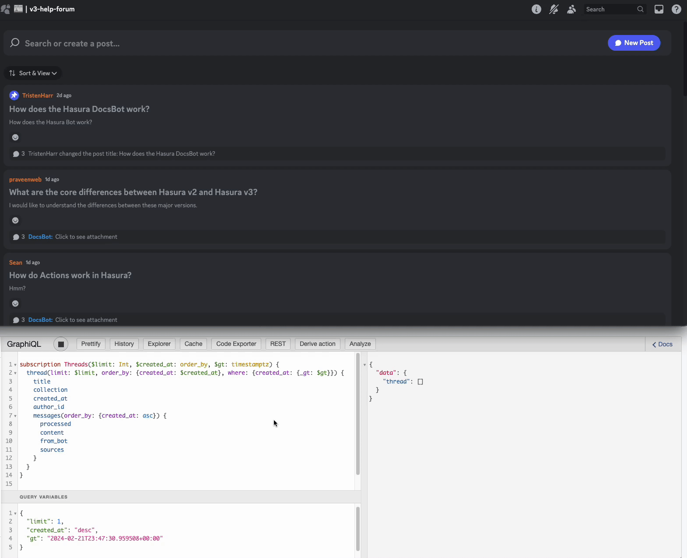
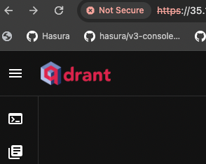
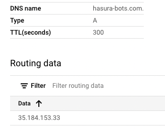
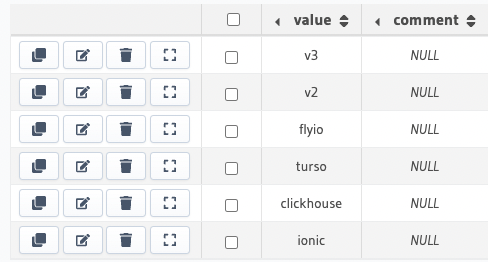
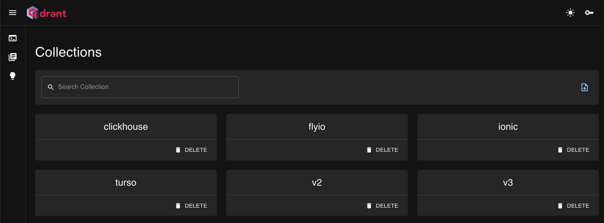
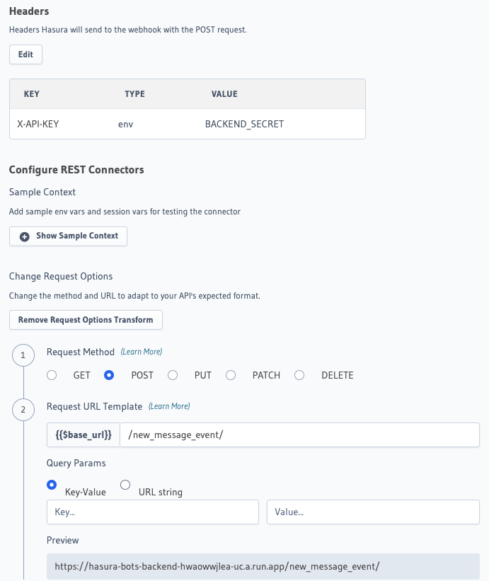
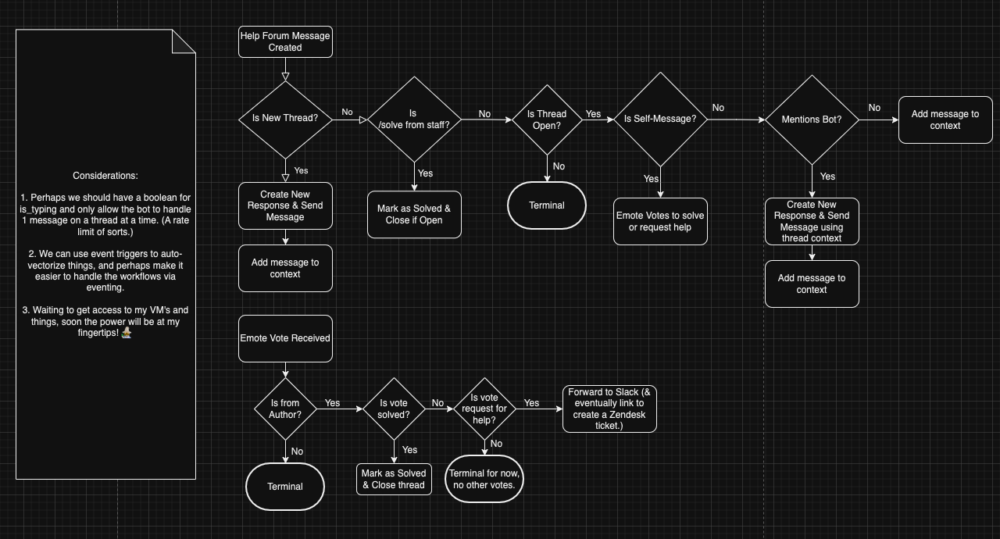
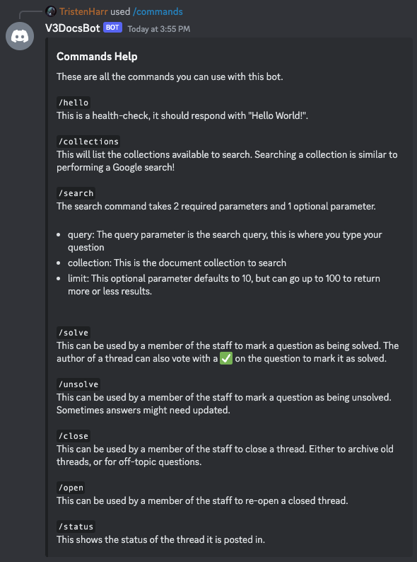

# An OSS Discord Bot to converse with documentation using ChatGPT + RAG

### Table of Contents

* [Introduction](#an-oss-discord-bot-to-converse-with-documentation-using-chatgpt--rag)
    * [Table of Contents](#table-of-contents)
    * [Beyond the Page: Crafting Our Own Conversational Google](#beyond-the-page-crafting-our-own-conversational-google)
    * [The Motivation for This Project](#the-motivation-for-this-project)
* [Part 1: Scraping the Documentation](#part-1-scraping-the-documentation)
* [Part 2: Deploying the Database](#part-2-deploying-the-database)
* [Part 3: Designing the PostgreSQL Database](#part-3-designing-the-postgresql-database)
* [Part 4: The Backend API](#part-4-the-backend-api)
    * [The `/upload_documents` Endpoint](#the-uploaddocuments-endpoint)
    * [The `/new_message_event` Endpoint](#the-newmessageevent-endpoint)
* [Part 5: Building the Bot](#part-5-building-the-bot)
* [Part 6: Talking with the Bot](#part-6-talking-with-the-bot)
* [Some Final Thoughts](#some-final-thoughts)




[This repository](https://github.com/hasura/hasura_discord_show_hn) contains the code for a Discord bot. There is a sprinkle of Nginx, a dash of Qdrant, some PostgreSQL, of course, Hasura, discord.py, a smidge of selenium and beautifulsoup, a pinch of FastAPI, and a lot of (mostly) production-ready Python with only a few dragons. 🐲

What might this bot do you wonder? I shall tell you! It's magic. 🧙‍♂️🪄

This Discord bot provides the ability to search and talk to technical documentation, or in theory any documentation.

I needed to write both a README and a blog post, so let's double up – such is life.

If you're more interested in running the bot yourself, see [the adjacent SETUP.md file](https://github.com/hasura/hasura_discord_show_hn/blob/main/SETUP.md).

If you work for or use Hasura, ClickHouse, Turso, Fly.io, or Ionic, this bot will be useful to you, so come try it. If you use [Docusaurus](https://docusaurus.io/blog/releases/3.1), then the provided web-scraper should work for you. (Although Algolia has me curious, I found it halfway through this project. Does anyone know if it's any good? Can I get it to spit out Markdown?)

Also, I've always been a production or GTFO kind of person, therefore the database I've deployed for this has a READONLY api-key. The bot runs on the [Hasura Discord server](https://discord.gg/hasura). Just use `/commands` in a Discord channel to see the capabilities. To converse with the bot, ask a Hasura-related question in either the v2-help-forum or the v3-help-forum.

Feel free to go over to [the production Qdrant dashboard](https://hasura-bots.com/dashboard) and use the following READONLY API key ```95a7cc2e3087b032edd2fd71de5b3a8d48313d601e6ce70b538ce5c8f730d93d``` to peruse the vector database points. (Hint: It is a database full of embeddings of scraped technical documentation written in markdown.)


### **Beyond the page: Crafting our own conversational Google**

A long time ago, these guys named Larry and Sergey decided to scrape the internet to organize the world's information, and it was hard. They also organized it about as well as a 5 year old might organize their chest of toys, by generally doing their best to throw similar things into the same bucket from across the room via a giant firehose. 

See, they didn't have [Word2Vec](https://en.wikipedia.org/wiki/Word2vec), and they definitely didn't have the new `text-embedding-3-large` embedding-model from OpenAI, or the `gpt-4-turbo-preview`, also known as `gpt-4-0125-preview`, which [as OpenAI puts it is](https://platform.openai.com/docs/models/gpt-4-and-gpt-4-turbo): "The latest GPT-4 model intended to reduce cases of “laziness” where the model doesn’t complete a task and returns a maximum of 4,096 output tokens" (which by the way has a 120,000 token context window). 

What a perfect and beautiful storm. It's not that the spider algorithm wasn't great for crawling the 🕸. I guess you could say the early Google team just didn't have a 🧠. Wait... no, that didn't come out right. What I mean to say is, using AI, we can sieve the data that comes through the firehose as it comes through, and create semantic embeddings via word2vec. And _then _create our own purpose-specific mini-Google that comes with a support bot, kind of like Clippy, Siri, or Alexa (but if any of those were actually good), and currently minus the voice activation. But I could look into adding that, all that would take is a pinch of ffmpeg after all.


### **The motivation for this project**

We should be able to completely automate every single support request that comes in that could be solved if the user had thoroughly read the entirety of the documentation. 

For every request that _can't_ be solved via an automated response, when a community member or support staff comes in and solves it, we can use that to train the AI for future iterations, and perhaps use the conversations to generate new or additional documentation.💡 

A tool such as this makes support an even more vital and helpful role, as it creates incentives to find correct reproducible solutions over quick solutions – even though currently support roles often are called in when things are on fire and people are in panic mode. This motivates all team members to properly solve each problem because all problems only need to be solved one time. 

Another bonus: By providing a searchable history of all previous inquiries, you can build the help you want to receive. I've not yet fine-tuned this bot, because I need people to create and vote on inquiries to collect the data. Conversational-style threads will be best, and it might be nice to curate the threads after the fact with a GPT comb-over. The result? \


* One model fine-tuned to editorialize the conversation. 
* One model fine-tuned to create lists of disparities in docs. 
* One model fine-tuned to take all that information and pop out updated documentation. 

In this scenario, people become curators of information rather than rote secretaries. Information doesn't get lost, and you can copy customer-interaction flows. Almost like a compile step. Imagine taking 10 models and layering them to chunk down information. If you build good datasets of the workflow in action, you could revolutionize the way information moves.

It's a very different world today than it was when Larry and Sergey first created Google. In the modern world, we have lots of very powerful tools at our disposal and the chips in our home computers are multiple orders of magnitude more capable than they were 25 years ago. 

A new age, a new era is upon us! To truly grasp what I'm getting at, look at how you can now visually identify semantic gaps in your documentation. 

You can understand where a user might get confused – just by looking at points that are far apart, or by not having a decent path to walk, or perhaps the path is just too long. Visualize the breadcrumbs and trails users will walk when they desire to do certain actions or have specific use cases and understand how you can support them before they even ask the questions.


So without further ado, let's dive in. I've broken this into sections. It's nitty-gritty technical, but if you've made it this far, you're clearly my type of reader, so hang on, we’re going deep.


# Part 1: Scraping the documentation

Why build a scraper? Because then I could use it on things other than documentation, in theory. It's a proof-of-concept – I built this whole thing in a week, so let's not judge too harshly.

I started by building a quick-and-dirty ChatGPT collaborative hack-n-slash script that consisted of me running the script, seeing it get snagged or formating something in a way I didn't like, as it would write each page to a Markdown file, point the scraper at that page, then copy-paste the exception and the html, and occasionally hand-guide it a bit by inspecting the page and doing some beautifulsoup magic. 

It was mostly ChatGPT doing the dirty work and me trying to make it work as fast as I possibly could (I couldn't really justify spending more than a day on the scraper).

The scraper ended up being very specific to Docusaurus. I thought about trying to scrape other documentation sites, but then realized... Well, everybody's docs for the most part can be represented or easily turned into Markdown, that's on other people. If you want your docs added, send me a script to scrape your docs and structure them as Markdown, however you want them to appear. 

Some people have asked me, “But Tristen, why scrape the docs?” I wanted fully qualified links, not relative links, and I really wanted to test out how things worked with different companies' documentation, as well. Plus, don't hate on the selenium + bs4 combo – we use all kinds of tools internally. I figured the semantic search results with hyperlinks to the document were essentially a super-powered Google search, and when I fed the results to the latest GPT model the outputs were pretty great. The citation of sources is nice. What's nicer is being able to re-run the scraper to update things.

Although I may have accidentally taken down the [reactnative.dev docs site](https://reactnative.dev) for a good 10 minutes when I forgot to change the sleep time from 0.01 seconds to 0.5 seconds, as scraping the [fly.io](https://fly.io/docs/) docs literally FLEW. 😅ReactNative docs _would have_ been included in this project, if I wasn't scared to attempt scraping them when they came back up would get me blacklisted. (I'd be lying if I said I've never taken down a website before, but always by accident, and always because when you web-scrape you have to choose whether you want to be polite and patient, or rude but impatient, and sometimes my ADHD gets the best of me and I get impatient.)

In the end, I wanted my scraped docs to be as human-readable as possible while also being as bot-friendly as possible. Even complex tables and things. I ended up with something like this, which I think is pretty nice. Notice how even the links inside the tables work and are fully qualified.

[Here’s the actual page for the below Markdown.](https://hasura.io/docs/latest/databases/feature-support/)

```markdown
# Database Feature Support

The below matrices show the database wise support for the different GraphQL features under schema, queries, mutations, and subscriptions.

Tip

Each ✅ below links **directly** to the feature within a particular type of database.

## Schema​

|  | Postgres | Citus | SQL Server | BigQuery | CockroachDB | CosmosDB |
|---|---|---|---|---|---|---|
| Table Relationships | [ ✅ ](https://hasura.io/docs/latest/schema/postgres/table-relationships/index/) | [ ✅ ](https://hasura.io/docs/latest/schema/postgres/table-relationships/index/) | [ ✅ ](https://hasura.io/docs/latest/schema/ms-sql-server/table-relationships/index/) | [ ✅ ](https://hasura.io/docs/latest/schema/bigquery/table-relationships/index/) | [ ✅ ](https://hasura.io/docs/latest/schema/postgres/table-relationships/index/) | [ ✅ ](https://hasura.io/docs/latest/schema/postgres/table-relationships/index/) |
| Remote Relationships | [ ✅ ](https://hasura.io/docs/latest/schema/postgres/remote-relationships/index/) | [ ✅ ](https://hasura.io/docs/latest/schema/postgres/remote-relationships/index/) | [ ✅ ](https://hasura.io/docs/latest/schema/ms-sql-server/remote-relationships/index/) | [ ✅ ](https://hasura.io/docs/latest/schema/bigquery/index/) | [ ❌ ](https://hasura.io/docs/latest/databases/postgres/cockroachdb/hasura-cockroachdb-compatibility/#relationships) | [ ✅ ](https://hasura.io/docs/latest/schema/postgres/remote-relationships/index/) |
| Views | [ ✅ ](https://hasura.io/docs/latest/schema/postgres/views/) | [ ✅ ](https://hasura.io/docs/latest/schema/postgres/views/) | [ ✅ ](https://hasura.io/docs/latest/schema/ms-sql-server/views/) | ✅ | [ ✅ ](https://hasura.io/docs/latest/schema/postgres/views/) | [ ✅ ](https://hasura.io/docs/latest/schema/postgres/views/) |
| Custom Functions | [ ✅ ](https://hasura.io/docs/latest/schema/postgres/custom-functions/) | [ ✅ ](https://hasura.io/docs/latest/schema/postgres/custom-functions/) | ❌ | ❌ | [ ❌ ](https://hasura.io/docs/latest/databases/postgres/cockroachdb/hasura-cockroachdb-compatibility/#functions) | [ ✅ ](https://hasura.io/docs/latest/schema/postgres/custom-functions/) |
| Enums | [ ✅ ](https://hasura.io/docs/latest/schema/postgres/enums/) | [ ✅ ](https://hasura.io/docs/latest/schema/postgres/enums/) | ❌ | ❌ | [ ✅ ](https://hasura.io/docs/latest/schema/postgres/enums/) | ❌ |
| Computed Fields | [ ✅ ](https://hasura.io/docs/latest/schema/postgres/computed-fields/) | [ ❌ ](https://hasura.io/docs/latest/databases/postgres/citus-hyperscale-postgres/hasura-citus-compatibility/#computed-fields) | ❌ | [ ✅ ](https://hasura.io/docs/latest/schema/bigquery/computed-fields/) | [ ❌ ](https://hasura.io/docs/latest/databases/postgres/cockroachdb/hasura-cockroachdb-compatibility/#functions) | ❌ |
| Data Validations | [ ✅ ](https://hasura.io/docs/latest/schema/postgres/data-validations/) | [ ✅ ](https://hasura.io/docs/latest/schema/postgres/data-validations/) | ✅ | [ ✅ ](https://hasura.io/docs/latest/schema/bigquery/data-validations/) | [ ✅ ](https://hasura.io/docs/latest/schema/postgres/data-validations/) | [ ✅ ](https://hasura.io/docs/latest/schema/postgres/data-validations/) |
| Relay Schema | [ ✅ ](https://hasura.io/docs/latest/schema/postgres/relay-schema/) | [ ✅ ](https://hasura.io/docs/latest/schema/postgres/relay-schema/) | ❌ | ❌ | ❌ | [ ✅ ](https://hasura.io/docs/latest/schema/postgres/relay-schema/) |
| Naming Conventions | [ ✅ ](https://hasura.io/docs/latest/schema/postgres/naming-convention/) | [ ❌ ](https://hasura.io/docs/latest/databases/postgres/citus-hyperscale-postgres/hasura-citus-compatibility/#naming-conventions) | ❌ | ❌ | [ ❌ ](https://hasura.io/docs/latest/databases/postgres/cockroachdb/hasura-cockroachdb-compatibility/#naming-conventions) | ❌ |
| Custom Fields | [ ✅ ](https://hasura.io/docs/latest/schema/postgres/custom-field-names/) | [ ✅ ](https://hasura.io/docs/latest/schema/postgres/custom-field-names/) | [ ✅ ](https://hasura.io/docs/latest/schema/ms-sql-server/custom-field-names/) | [ ✅ ](https://hasura.io/docs/latest/schema/bigquery/custom-field-names/) | [ ✅ ](https://hasura.io/docs/latest/schema/postgres/custom-field-names/) | [ ✅ ](https://hasura.io/docs/latest/schema/postgres/custom-field-names/) |
| Default Values | [ ✅ ](https://hasura.io/docs/latest/schema/postgres/default-values/index/) | [ ✅ ](https://hasura.io/docs/latest/schema/postgres/default-values/index/) | [ ✅ ](https://hasura.io/docs/latest/schema/ms-sql-server/default-values/index/) | ❌ | [ ✅ ](https://hasura.io/docs/latest/schema/postgres/default-values/index/) | [ ✅ ](https://hasura.io/docs/latest/schema/postgres/default-values/index/) |
```





# Part 2: Deploying the database

I did this last, but I'll talk about it second. I developed with Qdrant running in Docker locally, but indeed, I did need to deploy it.

I deployed Qdrant on an E2-medium with 4GB RAM and 2vCPUs and slapped a 20TB SSD on as my boot drive. It was just a pretty basic Debian-12 bookworm VM. I was trying to be as lazy as I possibly could about it and not even register a domain, and I would've got away with it too, if it weren't for that meddling Qdrant client being picky about rejecting self-signed certs.  I did suck it up and register a domain name, add the DNS records, and get signed by a CA, as seen by the aforementioned site: [https://hasura-bots.com/dashboard](https://hasura-bots.com/dashboard).

I guess we should start from the beginning: Thankfully I pulled down the command history to do just that via `history > commands.txt`.

When working with a new machine, first I like to get acquainted with it, it's kind of like meeting an old friend. This used to mean using some combo of `ls`, `pwd`, and `cd ..` or `cd some_dir` until I found a good path to call home and set up shop. But nowadays I can copy-paste some random statistics about my machine from the Google Cloud Console into ChatGPT, and like the hero of the story that it is, it lets me know lots of fancy commands that print out things I can at this point somewhat kind of decipher enough about the outputs to figure out if it’s all systems go, or if everything is broken and I need to go turn it off and then on again, and after like three tries doing that if nothing else works just nuke it and switch to Ubuntu.

Hello Machine, it's nice to meet you!

```shell
sudo apt-get update
cat /etc/os-release
uname -r
lscpo
lscpu
df -h
```

The next thing any good lazy person does is install Docker.

```shell
sudo apt install docker.io
sudo systemctl enable --now docker
sudo usermod -aG docker $USER
newgrp docker
docker --version
docker run hello-world
```


I think ChatGPT had intuited that I'd need to open ports, and so I gave its next suggestion a go, but I was pretty sure my next step would be to go to my firewall rules since I'm not actually running on metal, and I'm inside a VM...

```shell
tristen_harr@hasura-bots-qdrant:~$ sudo ufw allow 22
sudo: ufw: command not found
```


And I was right! Indeed, I was not using Uncomplicated Firewall, so as I had expected would happen, ChatGPT led me astray. But since I still knew where I was and where I needed to go, I could take over from the autopilot for a bit.

I booted the Docker container…

```shell
docker pull qdrant/qdrant
docker run -p 6333:6333 -p 6334:6334     -v $(pwd)/qdrant_storage:/qdrant/storage:z     qdrant/qdrant
```

and to my great delight…

```shell
           _                 _    
  __ _  __| |_ __ __ _ _ __ | |_  
 / _` |/ _` | '__/ _` | '_ \| __| 
| (_| | (_| | | | (_| | | | | |_  
 \__, |\__,_|_|  \__,_|_| |_|\__| 
    |_|                           

Access web UI at http://0.0.0.0:6333/dashboard
```


I had Qdrant running with absolutely no security whatsoever in my VM, so I opened my firewall to `tcp:6333`. I was able to go to the IP, and of course got the "insecure" warning you can click around and voilà – I had the Qdrant dashboard. No domain-name, just going directly to the IP and port: `my.ip.address:6333/dashboard`.

Here is an obligatory photo of the insecure dashboard:


I thought, hooray, we're done for now, I'll just deal with this Monday and buy a domain name then! But I did need to get encrypted traffic. No biggie though, I'll self-sign, I tell myself. So I self-sign and then go about wading through the [authentication configuration info for Qdrant](https://qdrant.tech/documentation/guides/security/). I wasn't worried so much about obtaining the ever-so-precious lock. 🔒I know I'm not malicious traffic, I built every part of this from the ground up, so no worries there, and I figured openssl would do just fine.

```shell
sudo apt-get install openssl
openssl req -x509 -newkey rsa:4096 -keyout key.pem -out cert.pem -days 365 -nodes -subj "/CN=my.public.ip.address"
mkdir qdrant
cd qdrant
touch config.yaml
vi config.yaml
```


I don't have the vi history as I went to configure Qdrant, but long story short, I configured the stuff, self-signed, got things working over http, but then the API I'd already integrated and did not feel like ripping out to replace with an http request yelled at me about the certs. Oops.

The problem was that the client didn't like that I'd self-signed and didn't have a CA, which came back to bite me, when ultimately Let's Encrypt then refused to sign a certificate with the CA name pointed at an IP address. So I gave in and did things properly and bought a domain [hasura-bots.com](https://hasura-bots.com/dashboard), then configured the Cloud DNS with an A record pointing at my VM's public IP.





Then I did the certbot challenges to get a certificate that was signed by a CA. In the end, ChatGPT did spit out a fancy docker-compose that seemed to spin things up and supposedly would renew the certs for me. Although, I still probably ought to go back and reduce that TTL… there's always more to do in retrospect, isn't there? Oh well, for now, it'll stay short in case I need to make changes, or at least that's what I'll tell myself, so I can sleep at night.

Database deployment accomplished! Boss battle ends in victory, XP, and blog-post fodder galore!

(All in all, I'm making this sound much easier than it actually was. No matter how anybody makes it sound, this stuff isn't easy, as evidenced by the commands.txt file, which I dumped my command line history to when I started writing this post. It took me 327 individual commands to complete this task, although it's mostly still `ls` and `cd some_dir`. Deploying the database for production is often like the final boss battle of a project, in my opinion, especially if it's a database you've never deployed before. Anyone who tells you it's easy is either lying or a much higher-level wizard than I am. And FYI using a fully managed DBaaS doesn't count as deploying a database!)


# Part 3: Designing the PostgreSQL database

I work for Hasura, and our company has built a pretty fantastic tool that I love to use when I'm building pretty much anything. This project is as simple as an event-driven project can be. There are five database tables, and one of them is a Hasura ENUM. I spun up a PostgreSQL database on Google's CloudSQL and created a new project on Hasura Cloud, and got down to work. This database was much easier to deploy, it’s just a few button clicks.

The first table, the aptly titled `COLLECTION_ENUM`, tracks the Qdrant collections we currently have in our Qdrant database.








The entries in this table map one-to-one with a document collection. The document collections were uploaded using a script that took the scraped documents, and utilized an endpoint in the `hasura_discord_backend` directory, but we'll get to that in a bit. Let's first view the forest, and I promise that soon we shall walk amongst the trees.

The idea for the main loop of the bot is simple, we have a help forum, and perhaps 90% of the questions I see in it could be answered by someone who had thoroughly read the entirety of the documentation. The problem is there isn't a person on earth who's thoroughly read EVERY piece of documentation. It would be nice if whenever somebody posted a question on the help forum, a bot could search through all of our documentation and attempt to provide a solution from what it finds. 

To do this, we can pull in the top five semantically similar documents to the user's query, throw them at ChatGPT as if the assistant had surfaced them, and  then ask the assistant to provide a new message solving the query. If the user then continues the conversation with the bot by pinging the bots username, we will collect the entire conversational back-and-forth and feed it to ChatGPT, stripping out any previously surfaced results, and doing a new search for the five most relevant documents for the conversation. 

Think of it like a sliding window over the conversation, we don't want to muddle up the bot by providing links to previously surfaced docs because then it'll bias the search to resurface those. So instead we track the conversations and the sources separately.

To make this work, we need to track the state of each of these forum questions, which we will call threads. So we have a thread table, which has the following fields:


* created_at: When the thread was created
* updated_at: When the thread last had activity, this will automatically get updated for us when we make changes
* open: If the thread is open or not, aka if it is archived in Discord
* solved: If the thread has been marked as solved
* thread_id: The ID of the thread, it's actually just a stringified bigint from Discord's underlying ID system.
* title: The title the user gives the thread
* collection: The collection the forum is associated with
* thread_controller_id: The ID of the first message sent by the bot in the thread that we listen for votes on
* author_id: The user who started the thread, who is also allowed to mark it as solved
* solved_votes: The number of votes the first message has received for solved
* failed_votes: The number of votes the first message has received for failed

These threads will also have messages, which we can keep in our database to make it easy to rebuild the conversation. The way the bot has been designed, we want to use an event loop to ensure that the messages get sent from the bot, and we can't afford to wait inside the bot code or put everything in a long-running function since Discord limits the time you have until you need to return a response. So we will utilize transactional polling.

The messages table has the following fields:


* thread_id: The ID of the thread the message belongs to
* message_id: The ID of the message, in this case a UUID, since we insert the message before Discord sends it
* content: The text body of the message
* from_bot: A boolean that is True if the message was sent from the bot, otherwise False
* created_at: The time the message was created
* updated_at: The last time the message was updated
* first_message: A boolean that is True if this is the first message sent in the thread - the first message always gets a reply
* mentions_bot: A boolean that is true if this message mentions the bot and should generate a reply
* sources: A text field that will contain the list of source citations, that's nullable as it will be null at first
* processed: A boolean that will be used to do a transactional poll and process the messages

What do I mean by a transactional poll? In the Discord bot event loop that runs every 1 second, I will run the followingGraphQL. (The resolvers which have been so graciously provided via Hasura.)

```graphql
mutation ProcessMessages {
    update_message(where: {from_bot: {_eq: true}, processed: {_eq: false}}, _set: {processed: true}) {
        returning {
            content
            created_at
            first_message
            from_bot
            mentions_bot
            message_id
            processed
            sources
            thread_id
            updated_at
            thread {
                thread_controller_id
                author_id
            }
        }
    }
}
```


This GraphQL will drive the event loop, and the astute reader might be starting to see the way things will come together. The workflow will be:


1. A user posts a message in the help-forum
2. The Discord bot, which is listening for new messages creates a new thread in the database and forwards the messages
3. The Hasura Engine kicks off an event when a new message is created, which calls the backend written in FastAPI
4. If the conditions are met to generate a new message, the backend searches the Qdrant embeddings, collects the results, and inserts a new message generated by ChatGPT from the bot with processed = False
5. The bots event loop picks up the new message and sends it into the Discord channel using the transactional poll

While it might seem complicated and over-built, and perhaps it is, it's durable, and it will be exceedingly easy to add onto in the future. 

It's also idempotent. For example, say the bot goes offline, when it starts back up, it will deliver any undelivered messages that were being processed when it went offline. Plus, it's got a built-in self-feeding training loop with the tracking of user votes. It'll be pretty simple to collect the message threads after they've been solved, and use them as future training data to fine-tune a GPT model.

The last two tables I added on after the fact to move some configuration out of a `contstants.py` file that had been hard-coded to make it easier for people to run this project themselves.

The configuration table:


* guild_id: The ID of a guild the bot is in
* logging_channel_id: The ID of the channel the bot should log to for that guild
* mod_role_id: The ID of that guilds moderator role
* banned_user_ids: A list of users who are banned from using the bot in this guild

The guild_forums table:


* guild_id: The ID of the guild the bot is in
* forum_channel_id: The ID of the forum channel that the bot auto-responds in
* forum_collection: The collection the forum channel searches


# Part 4: The backend API

Our backend API has **three endpoints**.

They are:


1. `/upload_documents` – A endpoint to upload a document to Qdrant
2. `/new_message_event` – A endpoint that Hasura calls when it gets a new message
3. `/search`– An extra endpoint to provide a command to simply vector-search the sources without ChatGPT

I'll now go over the first two endpoints, which happen to be the most important and share a bit of code.


## The `/upload_documents` endpoint

Originally, the documents were a list that I uploaded as a batch, and while I could've used uuids in

the [Qdrant vector database connector](https://github.com/hasura/ndc-qdrant) I have been working on, I made the ID's integers since I had to choose a default string or integer, and I happened to choose integer. However, I didn't like just randomly generating an integer like you would with uuid's since I'd likely end up with collisions. 

So the IDs ended up being chronological, so you pass the endpoint a single document, it will chunk it and upload as many points as it takes to fully embed the document and return the ID the next point should use. Inefficient, sure, but it gets the job done, and it's pretty simple to fix up into a batch endpoint later.

To do this, first I made some Pydantic models.

```python
DocumentSources = Literal[
    'Docs V2',
    'Docs V3',
    'Discord',
    'ZenDesk',
    'StackOverflow',
    'Reddit',
    'Slack',
    "Docs fly.io",
    "Docs Turso",
    "Docs Ionic"
]


class CreateDocumentForm(BaseModel):
    uid: int
    body: str
    source: DocumentSources
    url: str
    tags: List[str] = []


class UploadDocumentsRequest(BaseModel):
    collection: str
    document: CreateDocumentForm
```


Then I designed an endpoint to upload the documents, here's the function that powers things, it's quite simple. To be fair, I still need to go and add a client-pool for the Qdrant and OpenAI clients, but for now this will work. And since the bot spins down frequently as the API is stateless and hosted on Cloud Run, it might indeed be just fine or perhaps even better to do it this way. If more often than not it's cold-starting, the overhead for setting up a client-pool is slightly larger than to just open a single connection, ultimately reducing the efficiency.

```python
from models import *
from utilities import *
from constants import *
from qdrant_client.http.models import Distance, VectorParams, PointStruct
from qdrant_client.http.exceptions import UnexpectedResponse


async def do_upload_documents(documents: UploadDocumentsRequest):
    collection = documents.collection
    qdrant_client = get_qdrant_client()
    openai_client = get_openai_client()
    try:
        await qdrant_client.get_collection(collection_name=collection)
    except UnexpectedResponse:
        await qdrant_client.create_collection(
            collection_name=collection,
            vectors_config=VectorParams(size=VECTOR_SIZE, distance=Distance.COSINE)
        )
    doc = documents.document
    chunks = chunk_document(doc.body)
    offset = 0
    initial_id = doc.uid
    for c in chunks:
        embed = await openai_client.embeddings.create(input=c, model=OPENAI_EMBEDDING_MODEL)
        vector = embed.data[0].embedding
        parent = None
        if offset > 0:
            parent = initial_id + offset - 1
        await qdrant_client.upload_points(collection_name=collection,
                                          points=[PointStruct(
                                              id=initial_id + offset,
                                              vector=vector,
                                              payload={
                                                  "source": doc.source,
                                                  "parent": parent,
                                                  "tags": doc.tags,
                                                  "url": doc.url,
                                                  "body": c
                                              }
                                          )])
        offset += 1
    return offset
```


I was able to use this API endpoint to upload the scraped collections from Part 1 into Qdrant at this point. I watched as my API endpoint sang for a while.

```shell
INFO:     127.0.0.1:51525 - "POST /upload_documents/ HTTP/1.1" 200 OK
INFO:     127.0.0.1:51531 - "POST /upload_documents/ HTTP/1.1" 200 OK
INFO:     127.0.0.1:51537 - "POST /upload_documents/ HTTP/1.1" 200 OK
INFO:     127.0.0.1:51544 - "POST /upload_documents/ HTTP/1.1" 200 OK
INFO:     127.0.0.1:51549 - "POST /upload_documents/ HTTP/1.1" 200 OK
```

After a while of the uploads running in the background, I had the collections in Qdrant. 🎉


## The `/new_message_event` endpoint

Next step was to build the endpoint that will do the AI magic, which ultimately is also relatively simple. I really enjoy building event-driven workflows using Hasura and Hasura events, because it makes it easy to break things down into bite-sized pieces and makes the code for even complex things read about as easily as you might read a book. Here's the code.

```python
from models import *
from utilities import *
from constants import *
from uuid import uuid4


async def do_new_message_event(data: Event):
    qdrant_client = get_qdrant_client()
    openai_client = get_openai_client()
    message_data = data.event.data.new
    # If the message is "from the bot" i.e. this same endpoint inserts it, just return. This prevents a recursive event
    if message_data["from_bot"]:
        return
    else:
        # If this thread warrants a response, we should look up the threads' data.
        if message_data["first_message"] or message_data["mentions_bot"]:
            thread_data = await execute_graphql(GRAPHQL_URL,
                                                GET_THREAD_GRAPHQL,
                                                {"thread_id": message_data["thread_id"]},
                                                GRAPHQL_HEADERS)
            thread = thread_data.get("data", {}).get("thread_by_pk", None)
            if thread is None:
                return
            title = thread.get("title")
            collection = thread.get("collection")
            messages = [
                {"role": "system",
                 "content": SYSTEM_PROMPT
                 }
            ]
            vector_content = ""
            for i, message in enumerate(thread.get("messages")):
                if i == 0:
                    message["content"] = ROOT_QUERY_FORMAT.format(title=title, content=message["content"])
                new_message = {
                    "role": "assistant" if message_data["from_bot"] else "user",
                    "content": message["content"]
                }
                messages.append(new_message)
                vector_content += new_message["content"] + "\n"

                # A shortcoming of this bot is that once the context extends past the embedding limit for the
                # conversation, the bot will keep resurfacing the same results but that's not so terrible for now.
            embed = await openai_client.embeddings.create(input=vector_content, model=OPENAI_EMBEDDING_MODEL)
            vector = embed.data[0].embedding
            results = await qdrant_client.search(collection,
                                                 query_vector=vector,
                                                 limit=5,
                                                 with_payload=["url", "body"])
            # Construct the formatted inputs for the AI model
            formatted_text = ""
            search_links = ""
            for i, result in enumerate(results):
                formatted_text += RAG_FORMATTER.format(num=i + 1,
                                                       url=result.payload["url"],
                                                       score=result.score,
                                                       body=result.payload["body"])
                search_links += SEARCH_FORMATTER.format(num=i + 1,
                                                        score=result.score,
                                                        url=result.payload["url"])
            result_text = ASSISTANT_RESULTS_WRAPPER.format(content=formatted_text)
            messages.append({
                "role": "assistant",
                "content": result_text
            })
            # Generate the results using OpenAI's API
            completion = await openai_client.chat.completions.create(
                model=OPENAI_MODEL,
                messages=messages
            )
            result = completion.choices[0].message.content
            # Add a message to the thread.
            variables = {
                "object": {
                    "thread_id": message_data["thread_id"],
                    "message_id": str(uuid4()),
                    "content": result,
                    "from_bot": True,
                    "first_message": False,
                    "mentions_bot": False,
                    "sources": search_links,
                    "processed": False
                }
            }
            await execute_graphql(GRAPHQL_URL,
                                  INSERT_MESSAGE_GRAPHQL,
                                  variables,
                                  GRAPHQL_HEADERS)

```


I set up a Hasura event that would call my API endpoint whenever a new message was inserted into the message table, and of course forwarded the headers, which I pulled from the environment variables, which I stored the backend secret in.





That's pretty much the entire backend API. There is also a search endpoint that I linked to a slash command to let users search the documentation, but if you're interested in that, just read the code.


# Part 5: Building the bot

There are five parts to this, as it took me five days to build this bot. What started out as the following flowchart I made on draw.io when this project was just an idea, was finally about to become reality. (Mostly, with some minor changes to the original flowchart.)





Building the bot was much easier than I remembered, which I'm unsure if that had to do with Discord's APIs improving or me simply upskilling over the years as the last time I'd built a Discord bot was circa 2018/2019-ish. I won't go over all the code, but I will detail some of the fun parts.

The main things that mattered were listening to the `on_message` event, and the task loop.

When a new message comes in, we need to create that message in the database to trigger the event in the backend API. This is handled by registering a listener that will fire on all messages and filtering to only handle the messages we actually care about.

```python
@client.event
async def on_message(message: Message):
    """
    Each time a message is sent, this fires.

    :param message: The incoming message
    :return: The return from the linked handler function
    """
    if message.author.id in BANNED:
        await message.channel.send(content=f"Silly <@{message.author.id}>, you've misbehaved and have been BANNED. 🔨")
        return
    return await event_on_message(client, message)
```


Once the message has been sent, it triggers the event on the backend, which will create a reply and the transactional poll to process messages is performed inside the task loop.

```python
@tasks.loop(seconds=1, count=None, reconnect=True)
async def task_loop():
    """
    The main task loop.

    This is an event loop that runs every 1 second. It runs a transactional mutation to collect any unpublished messages

    If for some reason the task_loop fails, the message won't get sent. This is not a huge deal, the user can ask again.
    That shouldn't happen, however, doing this on a transactional poll like this is useful to ensure no more than
    once delivery, and aim for at least once.
    :return: The linked task loop
    """
    return await execute_task_loop(client)
```


The task loop makes sure that the replies get handled and sent in the Discord channel.

```python
from utilities import *
from constants import *
import discord


async def execute_task_loop(client: discord.Client):
    """
    This is the main task loop.
    :param client: The discord client. (essentially a singleton)
    :return: None
    """
    # Get all tasks
    result = await execute_graphql(GRAPHQL_URL,
                                   PROCESS_MESSAGES_GRAPHQL,
                                   {},
                                   GRAPHQL_HEADERS)
    # If False result skip as this was a failure.
    if not result:
        return
    # Collect the list of tasks
    all_tasks = result["data"]["update_message"]["returning"]
    for task in all_tasks:
        thread_id = task["thread_id"]
        content = task["content"]
        sources = task["sources"]
        thread = task["thread"]
        thread_controller_id = thread["thread_controller_id"]
        thread_author_id = thread["author_id"]
        channel = client.get_channel(int(thread_id))
        controller = await channel.fetch_message(int(thread_controller_id))
        await send_long_message_in_embeds(channel=channel,
                                          title=RESPONSE_TITLE,
                                          message=content)
        await send_long_message_in_embeds(channel=channel,
                                          title=RESPONSE_SOURCES_TITLE,
                                          message=sources,
                                          color=discord.Color.green())
        help_controller_message = HELP_CONTROLLER_MESSAGE.format(author=thread_author_id,
                                                                 bot=client.user.id,
                                                                 github=GITHUB_LINK)
        controller = await controller.edit(embed=discord.Embed(title=CONTROLLER_TITLE,
                                                               description=help_controller_message,
                                                               color=discord.Color.gold()))
        await controller.add_reaction(POSITIVE_EMOJI)
        await controller.add_reaction(NEGATIVE_EMOJI)
```


There were also a handful of slash commands I added, which running the `/commands` command in the Discord server will list out the different available commands and what they do.



# Part 6: Talking with the bot

The last thing to do is to talk to the bot! 


# Some final thoughts

I've just finished the first draft of this, and I'm not sure how much editing I'll do to it. Perhaps it'll be better to keep it a bit rough around the edges. I had a lot of fun building this, and hopefully, it will be of use to our community. The code is all OSS, so feel free to run this bot yourself.

If you liked this, and enjoyed the way I shoved it into a GitHub README, consider dropping a star on the repo, and maybe I can convince my employer to let me write all my blog posts in a README located adjacent to the code.

Want more? [Read my previous piece, The Architect's Dilemma: Navigating the world of GraphQL](https://hasura.io/blog/the-architects-dilemma-navigating-the-world-of-graphql/).

[Follow me on Twitter](https://twitter.com/TristenHarr)


