# Setting up the bot

So, you want to run your very own Discord Bot?

Let's talk setup. Lucky for you, this bot is pre-made in a way you can run it locally to experiment.

Please follow these steps **before** you run the `docker-compose up`

## Prerequisites:

1. You need Docker installed and the Docker Daemon running in the background
2. You need an OpenAI API Key and Organization ID
3. You need a Discord Server you want to run the bot in!

## Step 1: Creating a Discord Bot

The very first thing you need to do is create a Discord Application.

1. Sign in to the [Discord Developer Portal](https://discord.com/developers/applications) and go to the Applications
   page.


2. Click the "New Application" button.

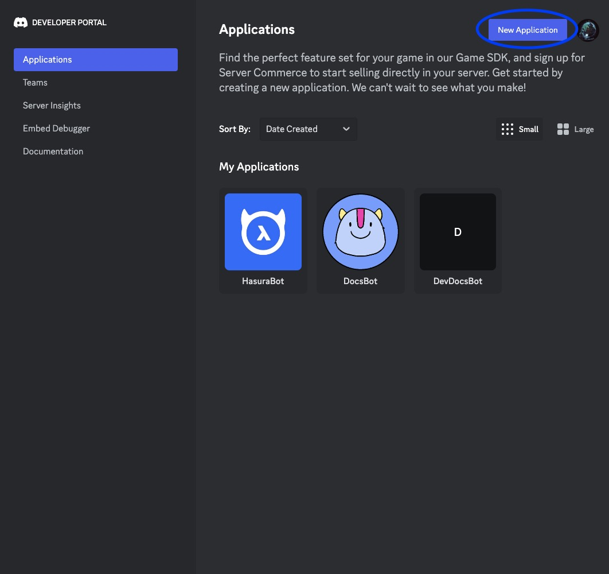

3. Create a name for your bot, agree to the ToS and click Create!

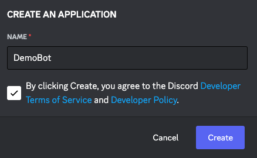

4. On the Bot tab, turn off "Public Bot", and turn on all the options in "Privileged Gateway Intents"

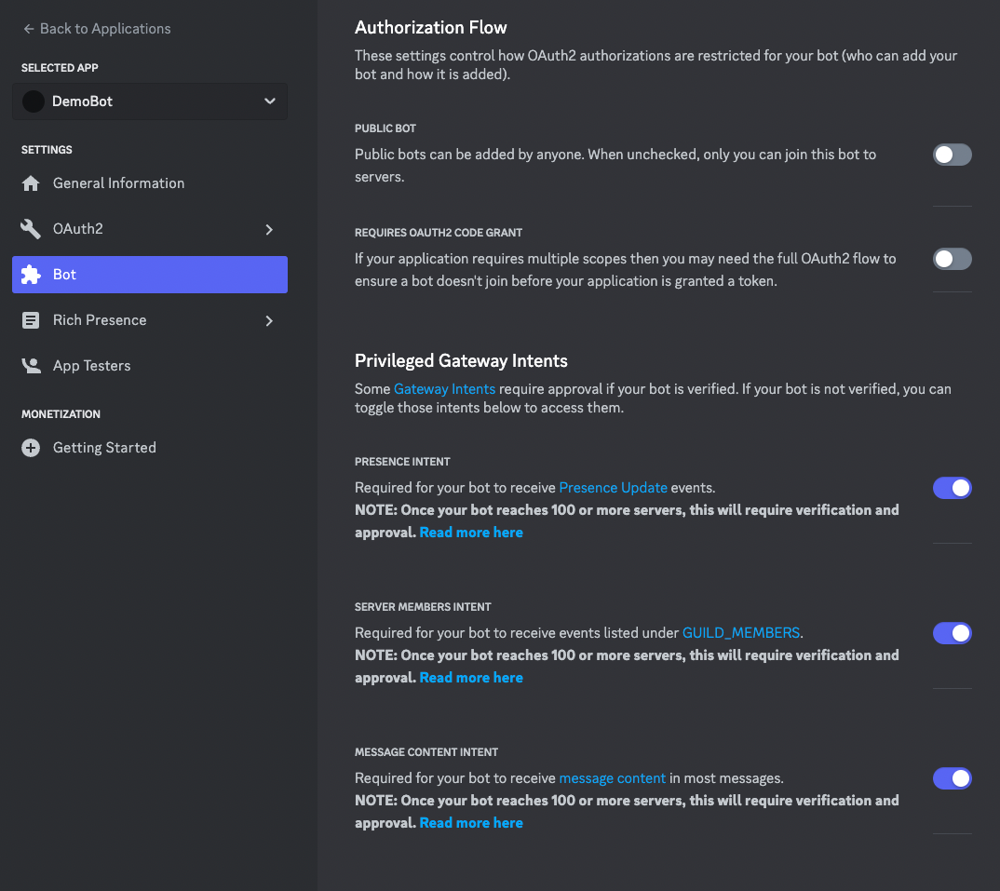

5. Under the OAuth2 tab, go to the URL Generator, and for scopes select bot, and for bot permissions select
   Administrator. (You can narrow the scopes if you wish, I typically just give my bots Admin especially if I'm planning
   to continue developing on them)

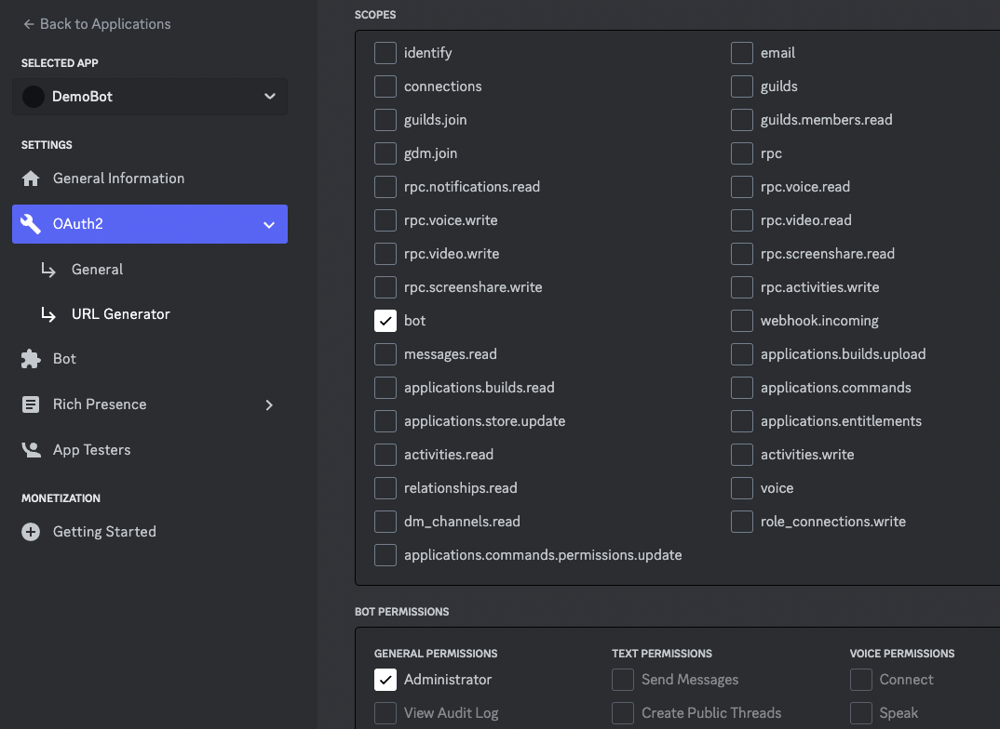

6. Copy the generated URL from the bottom of the page, and go into the Discord server you will run the bot in and paste
   it there.

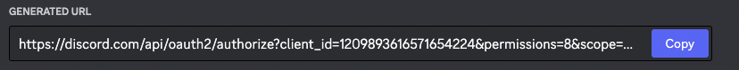

7. Click on the URL inside the Discord server, and then follow the prompts to add the bot to the server.

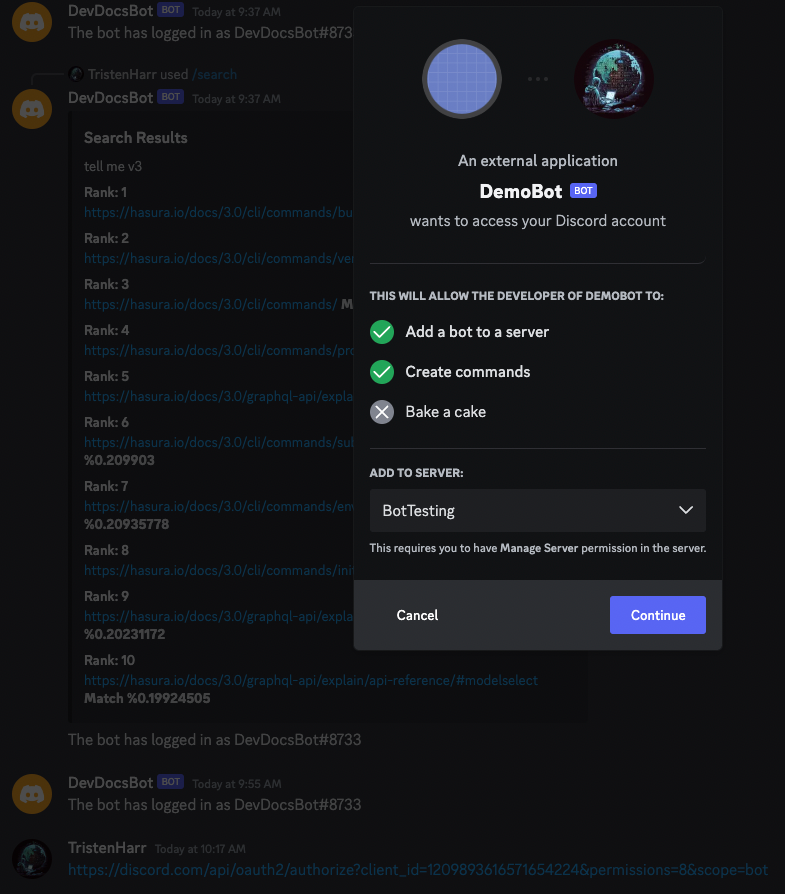

8. Go back to the Bot page in the Discord Developer Portal and click the Reset Token button.

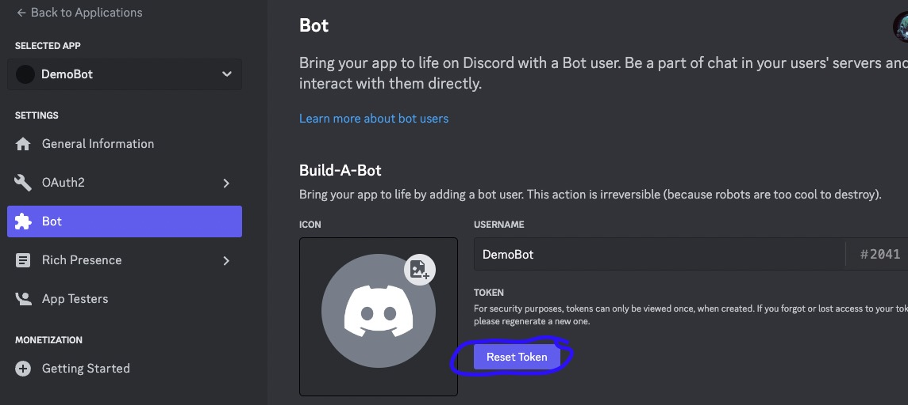

9. Copy the new Token and keep it somewhere safe, you'll need it in a minute! We'll refer to this as the "Discord Bot
   Token" later on.

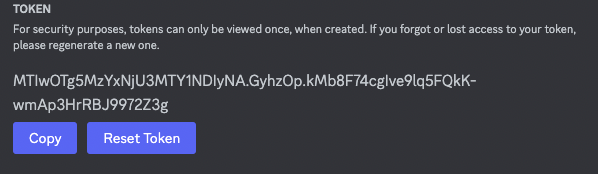

## Step 2: Setting up the Discord Server for the Bot, and updating the database seed data.

The Discord bot comes preloaded with a collection of Hasura's V3 documentation as an example in Qdrant. This collection
is called the v3 collection.

The way this bot currently works is that you need to seed the database with the configuration.

In order to make this process simple, I wrote a script called seed.py, and provide a template JSON file so that you can
configure the seed data.

This is the seed data that you will edit located at `seed.json`:

```json
{
  "COLLECTION_ENUM": [
    {
      "value": "v3"
    }
  ],
  "configuration": [
    {
      "guild_id": YOUR_GUILD_ID,
      "logging_channel_id": YOUR_LOGGING_CHANNEL_ID,
      "mod_role_id": YOUR_MOD_ROLE_ID,
      "banned_user_ids": []
    }
  ],
  "guild_forums": [
    {
      "guild_id": YOUR_GUILD_ID,
      "forum_channel_id": YOUR_V3_FORUM_CHANNEL_ID,
      "forum_collection": "v3"
    }
  ]
}
```

In Discord, you will need 1 Forum channel, 1 Text channel, and 1 User Role that will serve as a bot moderator role. You
will also need the Guild ID.

1. **To Collect the Guild ID**

Right-click on the Server name, and click "Copy Server ID". My Guild ID for example is: `1204239405011832883`. In
the `seed.json` file, fill in the above template replacing `YOUR_GUILD_ID` with the Guild Id.

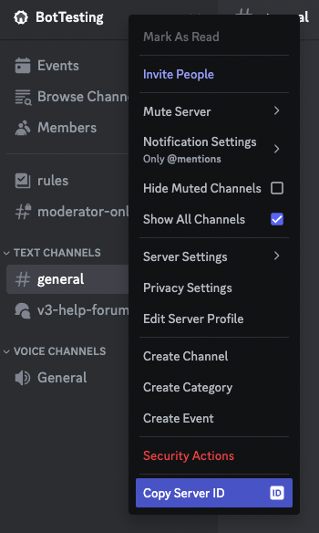

2. **To get the ID of the Logging Channel**

Pick a text-channel you want the bot to log things to. Right-click on the channel, and click "Copy Channel ID". My
channel ID for example is `1204239405456297995`. In the `seed.json` file, fill in the above template
replacing `YOUR_LOGGING_CHANNEL_ID` with the Channel ID.

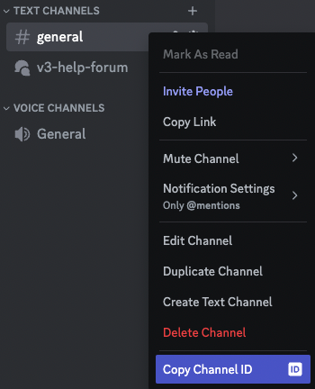

3. **To get the ID of the Forum Channel**

Pick a forum-channel the bot will link to the v3 collection. You can add more forum-channels and collections later.
Right-click on the forum and click "Copy Channel ID". My forum channel ID for example is: `1204246613145419806`. In
the `seed.json` file, fill in the above template replacing `YOUR_V3_FORUM_CHANNEL_ID` with the Channel ID.

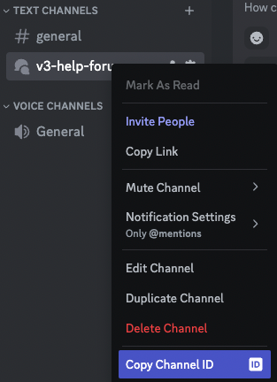

4. **To get the Moderator Role ID**

Right click on the server, and go to server settings, then under Roles, right-click a role that you want the bot to
recognize as a moderator, and click "Copy Role ID". My Role ID for example is `1209640032747528202`. In
the `seed.json` file, fill in the above template replacing `YOUR_MOD_ROLE_ID` with the Channel ID.

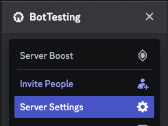

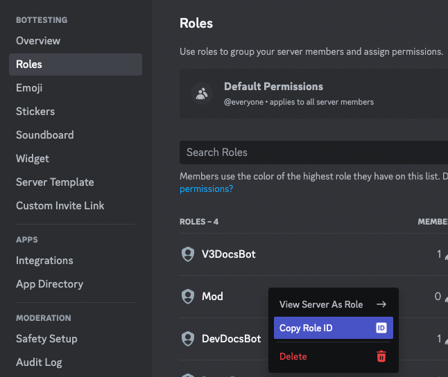

My `seed.json` which is what ships with the project looks like after being filled out:

```json
{
  "COLLECTION_ENUM": [
    {
      "value": "v3"
    }
  ],
  "configuration": [
    {
      "guild_id": 1204239405011832883,
      "logging_channel_id": 1204239405456297995,
      "mod_role_id": 1209640032747528202,
      "banned_user_ids": []
    }
  ],
  "guild_forums": [
    {
      "guild_id": 1204239405011832883,
      "forum_channel_id": 1204246613145419806,
      "forum_collection": "v3"
    }
  ]
}
```

Once you have finished filling out the JSON template, you can run the seed.py file. This script will overwrite the file
located at: `hasura_discord_postgres/data/seed.sql` which is used by the Postgres instance to seed the database.

In your terminal run:

```shell
python seed.py
```

(You could also directly edit the seed.sql file if you wanted, they both achieve the same results. I just find it easier
to work with JSON than writing SQL COPY bulk insert ops by hand)

## Step 3: Configuring the `.env` file

Create a .env file, making a copy of the `.env.example` file provided.

```shell
cp .env.example .env
```

Update the last 4 variables in the .env file.

Replace `<GUILD_ID>` with the Guild ID from step 2.1

Replace `<CLIENT_SECRET>` with the "Discord Bot Token" from step 1.9

Replace `<API_KEY>` with an OpenAI API Key.

Replace `<ORGANIZATION_ID>` with the OpenAI Organization ID.

```
GUILD_ID=<GUILD_ID>
DISCORD_CLIENT_SECRET=<CLIENT_SECRET>
OPENAI_API_KEY=<API_KEY>
OPENAI_ORGANIZATION=<ORGANIZATION_ID>
```

Once you've completed filling out those 4 variables in the `.env` file, you are ready to run the bot!

## Step 4: Running the bot

Run ```docker-compose up```

It might take a minute or two for everything to startup. You should be able to see the containers inside Docker.
If things have started successfully, the logging channel should receive a message from your bot.

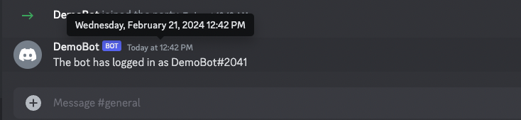

A note about the `docker-compose.yaml`: The hasura_discord_bot service passes an environment variable
called `SYNC_ON_STARTUP` which is set to 1. It is not recommended that the bot sync its commands every startup, however
you must sync the `/update` command at some point in order to perform future syncs. To overcome this, when the container
for the hasura_discord_bot service is started with environment variable SYNC_ON_STARTUP set to 1, the bot will sync on
startup. After the bot has synced, and you have access to the `/update` command in the Discord server, you can remove
this environment variable to follow recommended practices and avoid rate-limits.

## Testing the bot

The first test you can send to the bot, is a simple test. Use the `/hello` command. You should be able to see the
commands via a dropdown.

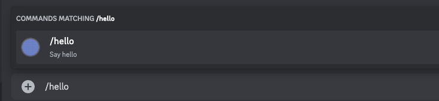

The bot should reply with `Hello World!`

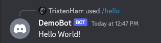

After that, you can use the `/commands` command to learn more about how the bot works.

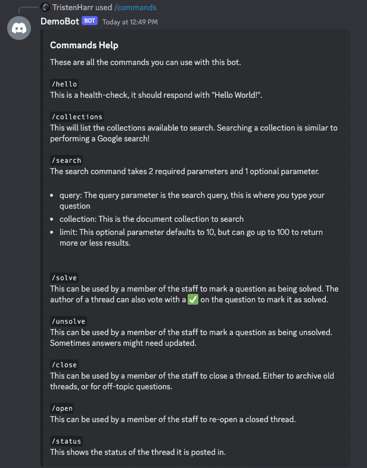

One important test, is to see if the search works. You should be able to search the `v3` collection.

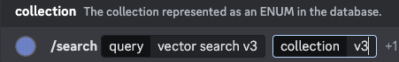

This should result in something like this.

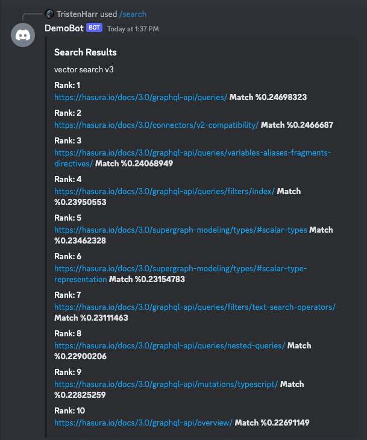

For some reason, this search is occasionally flaky when the whole thing starts up for the first time. I think it
might've been because the underlying Qdrant client initially had a timeout of 5 seconds. (Not sure why it would exceed
the timeout though?) I **think** increasing this to 60 seconds fixed it, but if you spot an Internal Service Error,
please open an issue and let me know!

Next, you can go into the forum channel, and create a post.

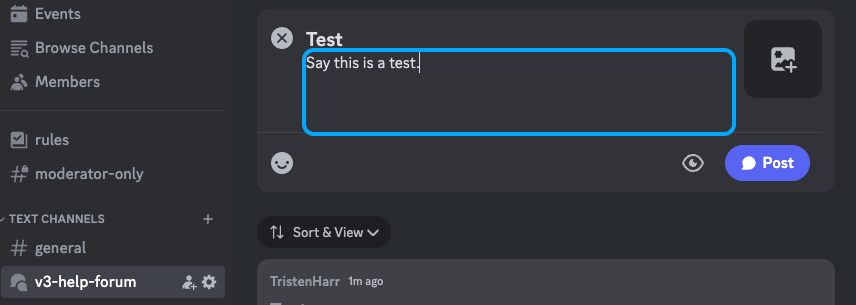

The bot should respond back to you, and you can converse with it.

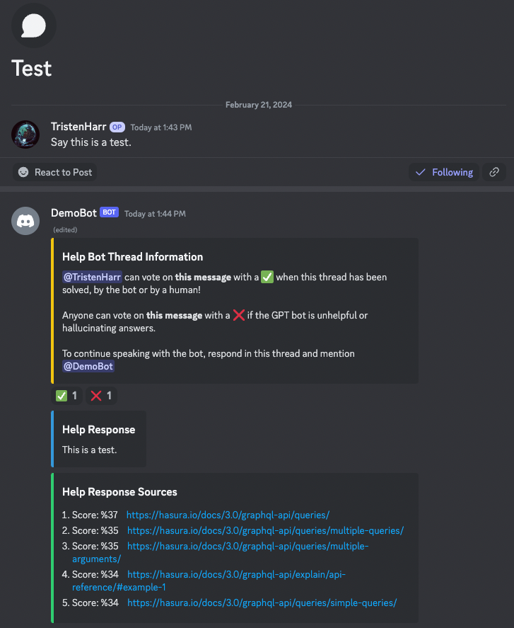

You can go to the Qdrant dashboard by navigating in a browser to: `http://localhost:6333/dashboard`

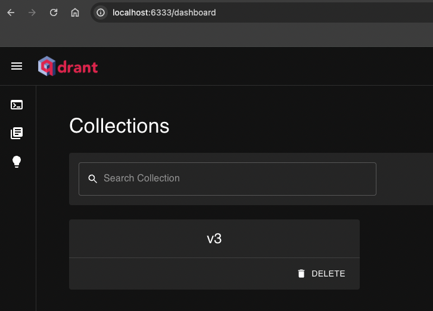

You can go to the Hasura Console by navigating in a browser to: `http://localhost:8080/console` and entering the default
value: `secret`. (This is set in the `.env` file.)

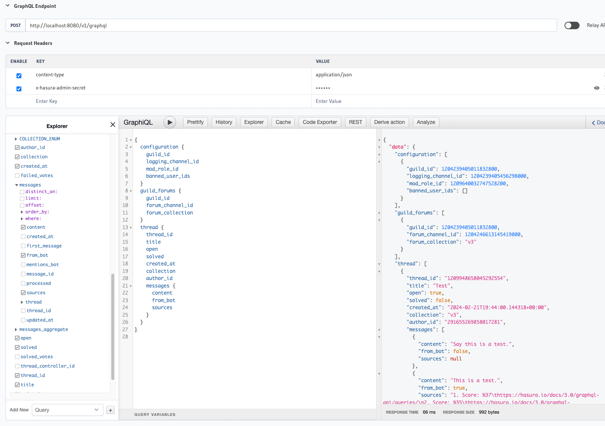

You can run this query.

```graphql
query Q {
    configuration {
        guild_id
        logging_channel_id
        mod_role_id
        banned_user_ids
    }
    guild_forums {
        guild_id
        forum_channel_id
        forum_collection
    }
    thread {
        thread_id
        title
        open
        solved
        created_at
        collection
        author_id
        messages {
            content
            from_bot
            sources
        }
    }
}
```

If you want to watch the bot working in action, run this subscription, then watch as you create a new post:

```graphql
subscription Threads {
    thread(limit: 10, order_by: {created_at: desc}) {
        thread_id
        title
        open
        solved
        created_at
        collection
        author_id
        messages {
            content
            from_bot
            sources
            processed
        }
    }
}
```

You can also see the API docs generated for the FastAPI backend in your choice of style:

Swagger: `http://localhost:8100/docs`

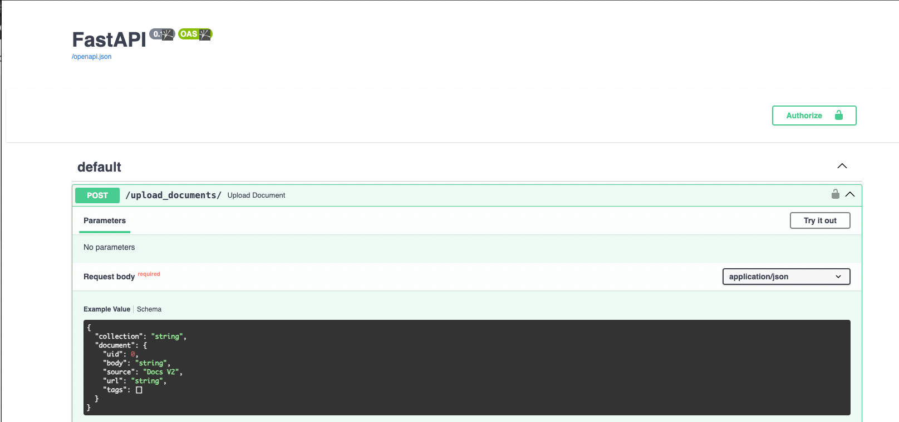

Redoc: `http://localhost:8100/redoc`

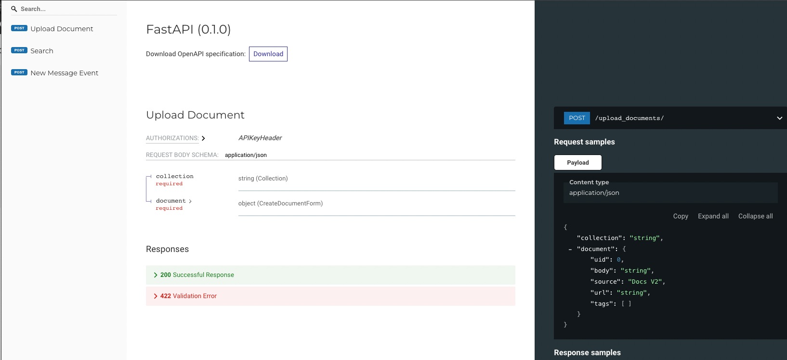

Hooray! You finished the Setup!